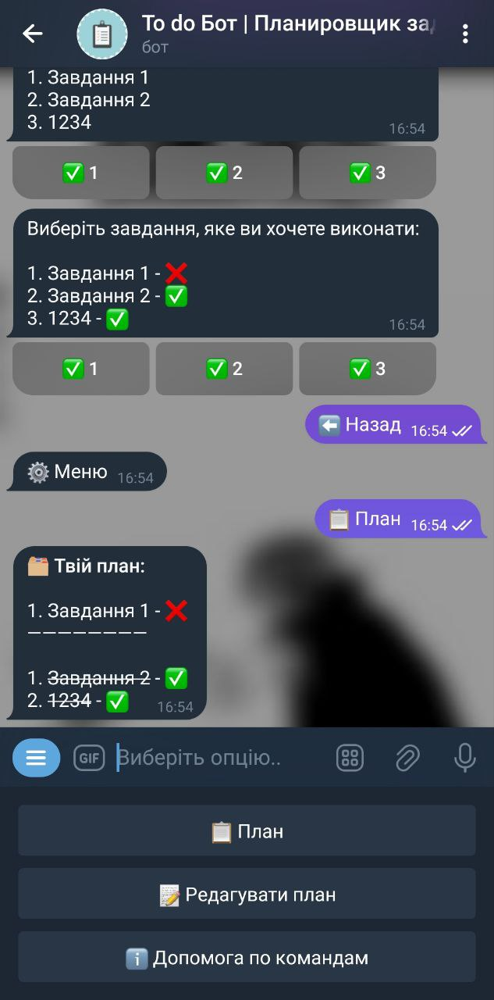
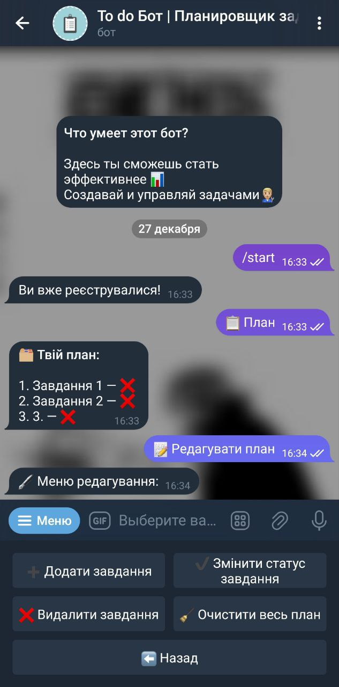
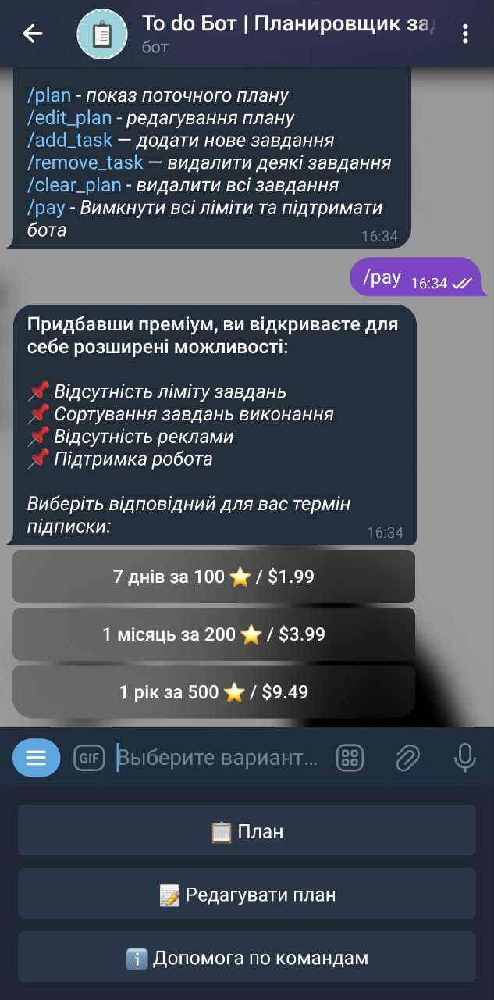

<h1 align="center"> 🤖 Planning Bot (Aiogram) </h1>

<table align="center">
  <tr>
    <td align="center"><br/>Main Page</td>
    <td align="center"><br/>Task Menu</td>
    <td align="center"><br/>VIP Features</td>
  </tr>
</table>

Your no-stress personal task manager right in Telegram.

Made by [Danya-Oleksuk](https://github.com/Danya-Oleksuk), this bot helps you stay organized — whether you're planning homework, business tasks, or life goals.

---

## ✨ Features

- 📝 Add & edit tasks  
- 🗑️ Instantly remove tasks  
- 🔁 Status updates like "done" or "in progress"  
- 👮 Admin panel with user management
- 📊 View bot and user statistics
- 📢 Broadcast messages (ads or updates)
- 🛡️ Anti-spam middleware for callback protection
- 🐘 PostgreSQL integration for persistent data storage

---

## 🚀 Getting Started

Follow these steps to get the bot up and running on your machine.

### 1. Clone the Repository

```bash
git clone https://github.com/Danya-Oleksuk/planning-bot-aiogram.git
cd planning-bot-aiogram
```

### 2. Install Dependencies

Make sure you have Python 3.10+ installed.

```bash
pip install -r requirements.txt
```

### 3. Set Up Environment Variables

You can either set them as system variables or create a `.env` file.

Example `.env`:

```env
BOT_TOKEN=<your_telegram_bot_token>

ADMIN_ID=<your_telegram_id>

DB_USER=<your_db_user>
DB_PASSWORD=<your_db_password>
DB_NAME=<your_db_name>
DB_HOST=<your_db_host>


MONGO_API_TOKEN=<your_mongo_api>
```

### 4. Launch the Bot

```bash
python main.py
```

---

## 🐳 Docker Setup (Optional)

You can run the bot in an isolated Docker container.

### 1. Build Docker Image

```bash
docker build -t planning-bot .
```

### 2. Run the Bot

```bash
docker run --env-file .env -d planning-bot
```

Make sure your PostgreSQL is accessible to the container.

---

## ⚙️ Technologies Used

- **Python** + **Aiogram** (Telegram framework)  
- **PostgreSQL** for database  
- **Docker** for containerization  
- **Asyncio**, **Logging**, and custom middlewares

---

## 📈 Planned Features

- ⏰ Task reminders  
